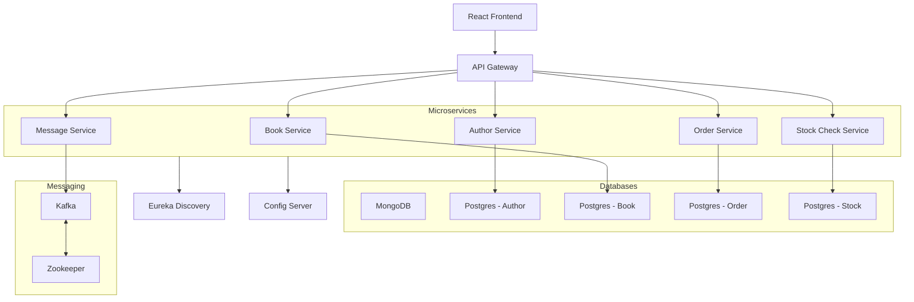

# Kubernetes Spring Microservices -- Manifests

## 1. Overview

This project provides **Kubernetes manifests** to deploy a **Spring Boot
Bookstore microservices application** with databases, messaging, service
discovery, API gateway, and frontend.

The stack includes: 
- **Core Services**: Eureka Discovery, Config Server, API Gateway
- **Databases**: PostgreSQL (per service), MongoDB
- **Messaging**: Kafka + Zookeeper
- **Microservices**: Book, Author, Order, Stock, Message
- **Frontend**: React application exposed via Ingress

------------------------------------------------------------------------

## 2. Architecture Diagram



------------------------------------------------------------------------

## 3. Deployment

### Apply manifests in order

``` bash
kubectl apply -f k8s/base/
kubectl apply -f k8s/databases/
kubectl apply -f k8s/messaging/
kubectl apply -f k8s/core-services/
kubectl apply -f k8s/microservices/
kubectl apply -f k8s/frontend/
kubectl apply -f k8s/networking/
```

(Optional: `kubectl apply -f k8s/monitoring/` if monitoring stack is
included.)

### Verify pods

``` bash
kubectl get pods -A
```

### Access via Ingress

Ingress exposes the frontend and API Gateway. Update `/etc/hosts` or
configure LoadBalancer to access externally.

------------------------------------------------------------------------